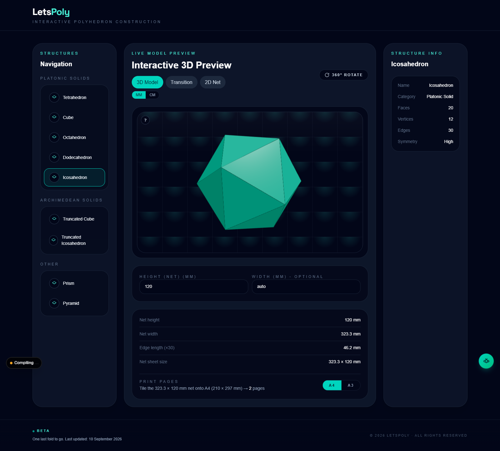

# LetsPoly

Interactive polyhedron construction — explore 3D solids, unfold them into 2D nets, and generate printable paper templates.



## Features

- **Explorer** (`/`) — the main app: rotate and zoom 3D polyhedra, play the fold/unfold transition, and use the net panel (the `app/generator/components/*` pieces) to pick a solid, size the template and print it.
- **`/explorer`** — permanent redirect to `/`, kept so older links keep working.
- **`/home`** — the original landing page, preserved but not linked from the app.
- **Report widget** — the floating button (bottom-right) emails anonymous bug reports / feedback to the maintainer through this app's own serverless route.

## Getting Started

```bash
npm install
npm run dev
```

Open [http://localhost:3000](http://localhost:3000).

On Windows you can also run the helper script, which installs dependencies and starts the dev server:

```powershell
./run-dev.ps1
```

## Scripts

| Script | Purpose |
| --- | --- |
| `npm run dev` | Dev server (webpack) writing to `.next` |
| `npm run build` | Production build → `.next-build` locally, `.next` on Vercel |
| `npm start` | Serve the production build |
| `npm run lint` | ESLint |
| `npm run hearts:check` | Diagnose the shared heart counter (env + store + running app) |

The dev/production output folders are kept separate (`next.config.ts`) so a production build can never corrupt a running dev server's `.next` cache.

## Mobile & touch

- **One finger drag rotates** the model; **two fingers pinch to zoom**. The 3D stage sets `touch-action: none`, so the page never scrolls away while you drag (this was the "can't rotate on a phone" bug — without it the browser claims the gesture and fires `pointercancel`).
- **Phones get the full viewport width.** The `min(90vw, 1600px)` desktop cap only applies from `sm` up, and the header, sticky picker, workspace and footer share one container, so the picker chips line up with the page content instead of hanging out over the left edge. Wasting 10% of a 390px screen also used to squeeze the structure-info cards until their labels spilled out of the 2-column grid.
- Below the `xl` breakpoint the layout stacks and reorders: a **sticky shape picker** (`/`), then the live preview, then the structure info. The full structures list is desktop-only.
- **The Transition view keeps a real model area on phones.** Its step pills (`3D Model / Partial Fold / Flat Net`) are a single compact row below `sm`, the fold controls drop their `3D`/`Flat` end labels, and the box is at least `58svh` tall. Before this the three pills stacked into ~156px of a 291px square and the fold controls needed 142px of a 134px area, so the canvas was never sized (it stayed at the 300×150 default and got clipped) and the model was effectively invisible. There is deliberately no `aspect-square` on the mobile transition box: with a definite `min-height` it also forces the *width*, which overflowed the column.
- The picker **scrolls the selected chip into view** (it is centred on load and after every tap). It is the only way to change the solid on a phone, and the header badge that names it is desktop-only — so an off-screen chip left no indication of what was loaded.
- Text fields are **16px on phones** (14px from `sm` up) so iOS Safari does not zoom the viewport when one is focused; that zoom used to shift the whole layout while entering a net size.
- All controls are at least **40px** tall, and the fold slider has a 40px touch area.
- The `?` badge next to the preview toggles a gesture cheat-sheet (it is tappable, not hover-only).

## Anonymous report emails

`POST /api/report` (`app/api/report/route.ts`) validates the message, silently drops honeypot spam, applies a light per-IP rate limit (5 reports / 10 minutes) and sends the email through [Resend](https://resend.com) **server-side**, so the API key is never exposed to the browser.

Environment variables — copy `.env.example` to `.env.local` for local testing and add the same keys in Vercel for production. Only the API key is required — reports go to the default project inbox unless `REPORT_TO_EMAIL` overrides it:

| Variable | Required | Purpose |
| --- | --- | --- |
| `RESEND_API_KEY` | yes | Resend API key (`re_...`) |
| `REPORT_TO_EMAIL` | no | Overrides the default project inbox (`letspolymake@gmail.com`) |
| `REPORT_FROM` | no | `From` header (default `LetsPoly Reports <onboarding@resend.dev>`) |
| `NEXT_PUBLIC_SUPPORT_EMAIL` | no | Fallback address in the “or email us” link (default `letspolymake@gmail.com`; empty hides the link) |

**Getting delivery working.** The recipient is already correct — the project inbox — so only two things stand between a submitted report and your inbox:

1. **`RESEND_API_KEY`** in Vercel → Settings → Environment Variables (Production *and* Preview), then **Redeploy** — environment changes only apply to new deployments.
2. **A sender Resend accepts.** Until a sending domain is verified, the sandbox sender `onboarding@resend.dev` only delivers to the address that **owns the Resend account**. So either sign up for Resend *as* `letspolymake@gmail.com`, or verify a domain and point `REPORT_FROM` at it.

Until step 1 is done, `POST /api/report` answers `500 {"ok": false, "error": "Email service is not configured yet (RESEND_API_KEY is missing)."}` — the message names the variable so a misconfigured deployment is obvious from the response alone.

No key? The report still gets through: on failure the panel shows a **pre-filled** `mailto:` link (subject, the visitor's text and the page URL), so their mail client opens ready to send to the same inbox. Hide that link entirely by setting `NEXT_PUBLIC_SUPPORT_EMAIL` to an empty value.

> **Not used: Web3Forms.** Its free plan rejects server-side calls (`403 … Pro plan is required`), and posting from the browser would expose the key — which is exactly why reports are relayed through this route instead of a client-side form service.

## Anonymous hearts (shared counter)

The “leave your mark” heart in the report panel is counted **globally**: every
distinct visitor adds one, and each visitor can add only one.

- `GET /api/hearts` → `{ ok, configured, count, hint? }`
- `POST /api/hearts` `{ id }` → `{ ok, configured, counted, count }`

How it stays honest without accounts:

- The browser generates a random anonymous id (localStorage) — no personal data.
  The server records it once with `SET … NX`, so a repeat click, reload or a
  second visit returns `counted: false` and leaves the total untouched.
- A per‑network **burst** budget applies to **new** hearts only. It is a short,
  time‑bucketed window (60 new hearts per 10 minutes), so it heals on its own
  instead of locking a whole address out — carriers, schools, offices and CGNAT
  put thousands of genuine visitors behind one IP, and the old 25‑per‑*day* cap
  froze the counter for everyone on such a network until midnight.
- If the platform tells the route nothing about the caller (no
  `x-forwarded-for` / `x-real-ip` / `cf-connecting-ip`), the network budget is
  **skipped** rather than hashing a missing header — one shared bucket would
  otherwise let a single budget rate‑limit the entire site. The visitor id is
  the real guard.
- Visitors whose browser blocks storage (Safari private browsing, “block all
  cookies”) still get an id for the page view, so their heart is counted instead
  of being dropped for having nothing to de‑duplicate on.
- A heart that could not be counted is **never silently swallowed**: the panel
  says why (burst limit / store unreachable) and the retry lock is released. The
  total also never moves backwards if a late response arrives after a click.
- Storage is Redis over the Upstash/Vercel KV REST API (no npm dependency).
  Env: `KV_REST_API_URL` + `KV_REST_API_TOKEN`, or the Upstash equivalents.

### Turning counting on (1 minute, free)

The shared total needs a store — without one the route cannot know about other
visitors, and it says so (`configured: false` plus a `hint` naming what is
missing).

1. **Create a Redis database** at [upstash.com](https://upstash.com) (or add
   Storage → Redis in Vercel). The free tier is plenty.
2. **Copy the REST URL and the write token** from that same database. Use the
   write token, not the read‑only one, and don’t mix a URL from one integration
   with a token from another — both answer `401 Unauthorized`, which looks
   exactly like “the counter is broken”.
3. **Add them in Vercel** → Settings → Environment Variables for **Production
   and Preview**:
   `KV_REST_API_URL` + `KV_REST_API_TOKEN` (Vercel KV) **or**
   `UPSTASH_REDIS_REST_URL` + `UPSTASH_REDIS_REST_TOKEN` (Upstash).
4. **Redeploy.** Environment changes only apply to new deployments, so a push or
   a “Redeploy” in Vercel is required; nothing changes in a running one.

Verify whenever you like — the command reports the variables it can see, writes
to the store with temporary keys (never the live total), and asks the deployed
app what it thinks:

```bash
npm run hearts:check -- --url https://<your-site>
```

`configured=true` and a `count` that grows when you open the site on a second
device means every visitor is being counted. For local development put the same
two lines in `.env.local` (copy `.env.example`) so your dev server shares the
counter too.

## Deploy on Vercel

The app is a standard Next.js project, so Vercel needs no extra configuration:

1. Go to [vercel.com/new](https://vercel.com/new) and import `Afifah1924/LetsPoly` (the framework is detected automatically).
2. Add the environment variables above to **Production** and **Preview**.
3. Deploy — every `git push` to `main` then ships automatically, and each PR gets a preview URL.

Resend sandbox note: while sending from `onboarding@resend.dev`, mail is only delivered to the Resend account owner's address. Verify a domain in Resend to send from `@yourdomain` to any recipient.

> This project previously deployed to GitHub Pages through a static export. That workflow was removed because a static export cannot host server-side routes such as `/api/report`.

